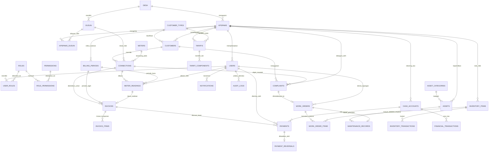

# SI-KPSPAMS KUAJANG - DATABASE SCHEMA & ERD SPECIFICATION
**Desain Database Relasional PostgreSQL, Data Dictionary, & Indeks**  
*Sistem Informasi Pengelolaan KPSPAMS Desa Kuajang*

---

## 1. ENTITY-RELATIONSHIP DIAGRAM (MERMAID)



---

## 2. DATA DICTIONARY LENGKAP (POSTGRESQL SPECIFICATION)

### 2.1 Modul Master Wilayah & Kelembagaan

#### Tabel: `desa`
Menyimpan profil tunggal Desa Kuajang.
```sql
CREATE TABLE desa (
    id SERIAL PRIMARY KEY,
    code VARCHAR(20) NOT NULL UNIQUE,       -- Contoh: '76.04.03.2001' (Kode BPS/Kemendagri)
    name VARCHAR(100) NOT NULL,             -- 'Desa Kuajang'
    subdistrict VARCHAR(100) NOT NULL,      -- 'Kecamatan Binuang'
    district VARCHAR(100) NOT NULL,         -- 'Kabupaten Polewali Mandar'
    province VARCHAR(100) NOT NULL,         -- 'Sulawesi Barat'
    postal_code VARCHAR(10),
    office_address TEXT,
    head_of_village VARCHAR(100),           -- Nama Kepala Desa
    phone VARCHAR(25),
    email VARCHAR(100),
    logo_path VARCHAR(255),
    created_at TIMESTAMP WITH TIME ZONE DEFAULT CURRENT_TIMESTAMP,
    updated_at TIMESTAMP WITH TIME ZONE DEFAULT CURRENT_TIMESTAMP
);
```

#### Tabel: `dusun`
Master 5 dusun di Desa Kuajang.
```sql
CREATE TABLE dusun (
    id SERIAL PRIMARY KEY,
    desa_id INT NOT NULL REFERENCES desa(id) ON DELETE RESTRICT,
    code VARCHAR(20) NOT NULL UNIQUE,       -- 'DSN-SR1', 'DSN-SR2', 'DSN-LMB', 'DSN-LMT', 'DSN-PKD'
    name VARCHAR(100) NOT NULL,             -- 'Sarampu 1', 'Sarampu 2', 'Lemo Baru', 'Lemo Tua', 'Pakkandoang'
    notes TEXT,
    created_at TIMESTAMP WITH TIME ZONE DEFAULT CURRENT_TIMESTAMP,
    updated_at TIMESTAMP WITH TIME ZONE DEFAULT CURRENT_TIMESTAMP
);
```

#### Tabel: `kpspams`
Master 3 unit KPSPAMS operasional di Desa Kuajang.
```sql
CREATE TABLE kpspams (
    id SERIAL PRIMARY KEY,
    desa_id INT NOT NULL REFERENCES desa(id) ON DELETE RESTRICT,
    code VARCHAR(20) NOT NULL UNIQUE,       -- 'KP-LMB', 'KP-LMT', 'KP-SR1'
    name VARCHAR(100) NOT NULL,             -- 'KPSPAMS Lemo Baru', 'KPSPAMS Lemo Tua', 'KPSPAMS Sarampu 1'
    decree_number VARCHAR(100),             -- Nomor SK Pengesahan Desa
    established_date DATE,
    office_address TEXT,
    contact_phone VARCHAR(25),
    contact_email VARCHAR(100),
    bank_account_info TEXT,
    is_active BOOLEAN NOT NULL DEFAULT TRUE,
    created_at TIMESTAMP WITH TIME ZONE DEFAULT CURRENT_TIMESTAMP,
    updated_at TIMESTAMP WITH TIME ZONE DEFAULT CURRENT_TIMESTAMP,
    deleted_at TIMESTAMP WITH TIME ZONE
);
```

#### Tabel: `kpspams_dusun` (Mapping Wilayah Layanan)
Menghubungkan KPSPAMS ke dusun binaannya (Many-to-Many).
```sql
CREATE TABLE kpspams_dusun (
    id SERIAL PRIMARY KEY,
    kpspams_id INT NOT NULL REFERENCES kpspams(id) ON DELETE CASCADE,
    dusun_id INT NOT NULL REFERENCES dusun(id) ON DELETE RESTRICT,
    assigned_date DATE NOT NULL DEFAULT CURRENT_DATE,
    is_primary BOOLEAN NOT NULL DEFAULT TRUE,
    created_at TIMESTAMP WITH TIME ZONE DEFAULT CURRENT_TIMESTAMP,
    CONSTRAINT uq_kpspams_dusun UNIQUE (kpspams_id, dusun_id)
);
-- Catatan Data Seeding:
-- KPSPAMS Lemo Baru -> Dusun Lemo Baru
-- KPSPAMS Lemo Tua -> Dusun Lemo Tua
-- KPSPAMS Sarampu 1 -> Dusun Sarampu 1 & Dusun Pakkandoang
-- Dusun Sarampu 2 -> Tidak ada relasi aktif di tabel ini pada tahap rilis awal
```

---

### 2.2 Modul Pengguna, Role, & Hak Akses (RBAC)

#### Tabel: `users`
```sql
CREATE TABLE users (
    id BIGSERIAL PRIMARY KEY,
    kpspams_id INT REFERENCES kpspams(id) ON DELETE SET NULL, -- NULL jika Super Admin atau Aparatur Desa
    name VARCHAR(150) NOT NULL,
    username VARCHAR(50) NOT NULL UNIQUE,
    email VARCHAR(150) UNIQUE,
    phone VARCHAR(25) NOT NULL UNIQUE,
    password VARCHAR(255) NOT NULL,
    customer_id BIGINT,                     -- Diisi jika role adalah Pelanggan (FK ditambahkan via ALTER)
    is_active BOOLEAN NOT NULL DEFAULT TRUE,
    last_login_at TIMESTAMP WITH TIME ZONE,
    last_login_ip VARCHAR(45),
    remember_token VARCHAR(100),
    created_at TIMESTAMP WITH TIME ZONE DEFAULT CURRENT_TIMESTAMP,
    updated_at TIMESTAMP WITH TIME ZONE DEFAULT CURRENT_TIMESTAMP,
    deleted_at TIMESTAMP WITH TIME ZONE
);
CREATE INDEX idx_users_kpspams ON users(kpspams_id);
```

#### Tabel: `roles` & `permissions`
```sql
CREATE TABLE roles (
    id SERIAL PRIMARY KEY,
    name VARCHAR(50) NOT NULL UNIQUE,       -- 'super_admin', 'admin_desa', 'pemerintah_desa', 'ketua_kpspams', 'admin_kpspams', 'bendahara_kpspams', 'petugas_lapangan', 'pelanggan'
    display_name VARCHAR(100) NOT NULL,
    description TEXT,
    scope_level VARCHAR(20) NOT NULL,       -- 'GLOBAL', 'DESA', 'KPSPAMS', 'CUSTOMER'
    created_at TIMESTAMP WITH TIME ZONE DEFAULT CURRENT_TIMESTAMP,
    updated_at TIMESTAMP WITH TIME ZONE DEFAULT CURRENT_TIMESTAMP
);

CREATE TABLE permissions (
    id SERIAL PRIMARY KEY,
    name VARCHAR(100) NOT NULL UNIQUE,      -- 'invoice:create', 'payment:void', dll
    category VARCHAR(50) NOT NULL,          -- 'Billing', 'Operasional', 'Keuangan', 'Aset'
    display_name VARCHAR(150) NOT NULL,
    description TEXT,
    created_at TIMESTAMP WITH TIME ZONE DEFAULT CURRENT_TIMESTAMP
);

CREATE TABLE user_roles (
    user_id BIGINT NOT NULL REFERENCES users(id) ON DELETE CASCADE,
    role_id INT NOT NULL REFERENCES roles(id) ON DELETE CASCADE,
    PRIMARY KEY (user_id, role_id)
);

CREATE TABLE role_permissions (
    role_id INT NOT NULL REFERENCES roles(id) ON DELETE CASCADE,
    permission_id INT NOT NULL REFERENCES permissions(id) ON DELETE CASCADE,
    PRIMARY KEY (role_id, permission_id)
);
```

---

### 2.3 Modul Pelanggan, Sambungan, & Meter

#### Tabel: `customer_types`
```sql
CREATE TABLE customer_types (
    id SERIAL PRIMARY KEY,
    code VARCHAR(20) NOT NULL UNIQUE,       -- 'RUMAH_TANGGA', 'NIAGA', 'SOSIAL', 'INSTANSI'
    name VARCHAR(100) NOT NULL,
    description TEXT,
    is_active BOOLEAN NOT NULL DEFAULT TRUE,
    created_at TIMESTAMP WITH TIME ZONE DEFAULT CURRENT_TIMESTAMP
);
```

#### Tabel: `customers`
```sql
CREATE TABLE customers (
    id BIGSERIAL PRIMARY KEY,
    kpspams_id INT NOT NULL REFERENCES kpspams(id) ON DELETE RESTRICT,
    customer_type_id INT NOT NULL REFERENCES customer_types(id) ON DELETE RESTRICT,
    code VARCHAR(30) NOT NULL UNIQUE,       -- 'CUST-LMB-0001'
    nik VARCHAR(20) NOT NULL,               -- Nomor Induk Kependudukan
    no_kk VARCHAR(20),                      -- Nomor Kartu Keluarga
    full_name VARCHAR(150) NOT NULL,
    phone VARCHAR(25) NOT NULL,
    email VARCHAR(100),
    identity_address TEXT NOT NULL,
    status VARCHAR(20) NOT NULL DEFAULT 'ACTIVE', -- 'ACTIVE', 'INACTIVE', 'SUSPENDED'
    registration_date DATE NOT NULL DEFAULT CURRENT_DATE,
    created_at TIMESTAMP WITH TIME ZONE DEFAULT CURRENT_TIMESTAMP,
    updated_at TIMESTAMP WITH TIME ZONE DEFAULT CURRENT_TIMESTAMP,
    deleted_at TIMESTAMP WITH TIME ZONE
);
CREATE INDEX idx_customers_kpspams ON customers(kpspams_id);
CREATE INDEX idx_customers_nik ON customers(nik);
```

#### Tabel: `meters`
```sql
CREATE TABLE meters (
    id BIGSERIAL PRIMARY KEY,
    kpspams_id INT NOT NULL REFERENCES kpspams(id) ON DELETE RESTRICT,
    serial_number VARCHAR(50) NOT NULL,     -- Nomor Seri Fisik Meter
    brand VARCHAR(50) NOT NULL,             -- Merk (Onda, Barindo, dll)
    diameter_inch VARCHAR(10) NOT NULL DEFAULT '1/2',
    initial_reading NUMERIC(10,2) NOT NULL DEFAULT 0.00,
    installation_date DATE,
    condition VARCHAR(20) NOT NULL DEFAULT 'GOOD', -- 'GOOD', 'FAULTY', 'BLURRED', 'BROKEN'
    is_active BOOLEAN NOT NULL DEFAULT TRUE,
    created_at TIMESTAMP WITH TIME ZONE DEFAULT CURRENT_TIMESTAMP,
    updated_at TIMESTAMP WITH TIME ZONE DEFAULT CURRENT_TIMESTAMP,
    CONSTRAINT uq_kpspams_meter_serial UNIQUE (kpspams_id, serial_number)
);
CREATE INDEX idx_meters_kpspams ON meters(kpspams_id);
```

#### Tabel: `connections` (Sambungan Rumah)
```sql
CREATE TABLE connections (
    id BIGSERIAL PRIMARY KEY,
    kpspams_id INT NOT NULL REFERENCES kpspams(id) ON DELETE RESTRICT,
    customer_id BIGINT NOT NULL REFERENCES customers(id) ON DELETE RESTRICT,
    dusun_id INT NOT NULL REFERENCES dusun(id) ON DELETE RESTRICT,
    meter_id BIGINT UNIQUE REFERENCES meters(id) ON DELETE RESTRICT,
    connection_no VARCHAR(50) NOT NULL UNIQUE, -- 'SR-LMB-00123'
    address_detail TEXT NOT NULL,
    latitude NUMERIC(10,8),
    longitude NUMERIC(11,8),
    status VARCHAR(20) NOT NULL DEFAULT 'ACTIVE', -- 'ACTIVE', 'SEALED', 'DISCONNECTED', 'TERMINATED'
    installed_date DATE NOT NULL DEFAULT CURRENT_DATE,
    notes TEXT,
    created_at TIMESTAMP WITH TIME ZONE DEFAULT CURRENT_TIMESTAMP,
    updated_at TIMESTAMP WITH TIME ZONE DEFAULT CURRENT_TIMESTAMP,
    deleted_at TIMESTAMP WITH TIME ZONE
);
CREATE INDEX idx_connections_kpspams ON connections(kpspams_id);
CREATE INDEX idx_connections_dusun ON connections(dusun_id);
CREATE INDEX idx_connections_customer ON connections(customer_id);

-- Menambahkan Foreign Key balik ke users untuk login pelanggan
ALTER TABLE users ADD CONSTRAINT fk_users_customer FOREIGN KEY (customer_id) REFERENCES customers(id) ON DELETE SET NULL;
```

---

### 2.4 Modul Tarif, Periode Tagihan, & Pembacaan Meter

#### Tabel: `tariffs` & `tariff_components`
```sql
CREATE TABLE tariffs (
    id SERIAL PRIMARY KEY,
    kpspams_id INT NOT NULL REFERENCES kpspams(id) ON DELETE RESTRICT,
    customer_type_id INT NOT NULL REFERENCES customer_types(id) ON DELETE RESTRICT,
    name VARCHAR(100) NOT NULL,             -- 'Tarif Rumah Tangga 2026'
    effective_from DATE NOT NULL,           -- Tanggal mulai berlaku tarif
    effective_until DATE,                   -- Tanggal akhir berlaku (NULL jika masih berlaku aktif)
    status VARCHAR(20) NOT NULL DEFAULT 'ACTIVE', -- 'ACTIVE', 'INACTIVE', 'SUPERSEDED'
    fixed_admin_fee NUMERIC(14,2) NOT NULL DEFAULT 0.00,
    maintenance_fee NUMERIC(14,2) NOT NULL DEFAULT 0.00,
    late_penalty_fee NUMERIC(14,2) NOT NULL DEFAULT 0.00, -- Default Rp0 untuk MVP
    created_at TIMESTAMP WITH TIME ZONE DEFAULT CURRENT_TIMESTAMP,
    updated_at TIMESTAMP WITH TIME ZONE DEFAULT CURRENT_TIMESTAMP
);
CREATE INDEX idx_tariffs_lookup ON tariffs(kpspams_id, customer_type_id, effective_from);

CREATE TABLE tariff_components (
    id SERIAL PRIMARY KEY,
    tariff_id INT NOT NULL REFERENCES tariffs(id) ON DELETE CASCADE,
    tier_order INT NOT NULL DEFAULT 1,       -- 1, 2, 3
    tier_min_m3 INT NOT NULL,               -- Misal: 0, 11, 21
    tier_max_m3 INT,                        -- Misal: 10, 20, NULL (untuk tak hingga)
    rate_per_m3 NUMERIC(14,2) NOT NULL,     -- Harga per m3
    created_at TIMESTAMP WITH TIME ZONE DEFAULT CURRENT_TIMESTAMP
);

-- Kebijakan Jatuh Tempo, Denda, & Rekomendasi Pemutusan Per KPSPAMS
CREATE TABLE kpspams_billing_policies (
    id SERIAL PRIMARY KEY,
    kpspams_id INT NOT NULL UNIQUE REFERENCES kpspams(id) ON DELETE CASCADE,
    due_day_of_month INT NOT NULL DEFAULT 20,             -- Tanggal jatuh tempo per bulan
    late_penalty_type VARCHAR(20) NOT NULL DEFAULT 'NONE', -- 'NONE', 'FLAT', 'PERCENTAGE'
    late_penalty_amount NUMERIC(14,2) NOT NULL DEFAULT 0.00, -- Default Rp0 untuk MVP
    sp1_arrears_months INT NOT NULL DEFAULT 1,            -- Ambang batas bulan terbit SP1
    sp2_arrears_months INT NOT NULL DEFAULT 2,            -- Ambang batas bulan terbit SP2
    disconnect_recommendation_months INT NOT NULL DEFAULT 3, -- Ambang batas rekomendasi pemutusan
    reconnect_fee NUMERIC(14,2) NOT NULL DEFAULT 0.00,    -- Biaya penyambungan jika ada
    is_auto_disconnect BOOLEAN NOT NULL DEFAULT FALSE,    -- MVP: Selalu FALSE (Rekomendasi administratif saja)
    created_at TIMESTAMP WITH TIME ZONE DEFAULT CURRENT_TIMESTAMP,
    updated_at TIMESTAMP WITH TIME ZONE DEFAULT CURRENT_TIMESTAMP
);
CREATE INDEX idx_billing_policies_kpspams ON kpspams_billing_policies(kpspams_id);
```

#### Tabel: `billing_periods`
```sql
CREATE TABLE billing_periods (
    id SERIAL PRIMARY KEY,
    kpspams_id INT NOT NULL REFERENCES kpspams(id) ON DELETE RESTRICT,
    period_code VARCHAR(20) NOT NULL,       -- '2026-10-LMB'
    name VARCHAR(50) NOT NULL,              -- 'Oktober 2026'
    year INT NOT NULL,
    month INT NOT NULL,
    reading_start_date DATE NOT NULL,
    reading_end_date DATE NOT NULL,
    billing_date DATE NOT NULL,
    due_date DATE NOT NULL,
    status VARCHAR(20) NOT NULL DEFAULT 'OPEN', -- 'OPEN', 'READING', 'INVOICED', 'CLOSED'
    created_at TIMESTAMP WITH TIME ZONE DEFAULT CURRENT_TIMESTAMP,
    updated_at TIMESTAMP WITH TIME ZONE DEFAULT CURRENT_TIMESTAMP,
    CONSTRAINT uq_kpspams_period UNIQUE (kpspams_id, year, month)
);
CREATE INDEX idx_billing_periods_kpspams ON billing_periods(kpspams_id);
```

#### Tabel: `meter_readings`
```sql
CREATE TABLE meter_readings (
    id BIGSERIAL PRIMARY KEY,
    kpspams_id INT NOT NULL REFERENCES kpspams(id) ON DELETE RESTRICT,
    billing_period_id INT NOT NULL REFERENCES billing_periods(id) ON DELETE RESTRICT,
    connection_id BIGINT NOT NULL REFERENCES connections(id) ON DELETE RESTRICT,
    meter_id BIGINT NOT NULL REFERENCES meters(id) ON DELETE RESTRICT,
    reader_user_id BIGINT REFERENCES users(id) ON DELETE SET NULL,
    reading_date DATE NOT NULL DEFAULT CURRENT_DATE,
    previous_reading NUMERIC(10,2) NOT NULL,
    current_reading NUMERIC(10,2) NOT NULL,
    usage_m3 NUMERIC(10,2) NOT NULL,
    meter_photo_path VARCHAR(255) NOT NULL,
    latitude NUMERIC(10,8),
    longitude NUMERIC(11,8),
    status VARCHAR(20) NOT NULL DEFAULT 'PENDING', -- 'PENDING', 'VERIFIED', 'ANOMALY_ROLLBACK', 'ANOMALY_SPIKE', 'REJECTED'
    anomaly_reason TEXT,
    verified_by BIGINT REFERENCES users(id) ON DELETE SET NULL,
    verified_at TIMESTAMP WITH TIME ZONE,
    notes TEXT,
    created_at TIMESTAMP WITH TIME ZONE DEFAULT CURRENT_TIMESTAMP,
    updated_at TIMESTAMP WITH TIME ZONE DEFAULT CURRENT_TIMESTAMP,
    CONSTRAINT uq_period_connection_reading UNIQUE (billing_period_id, connection_id)
);
CREATE INDEX idx_meter_readings_kpspams ON meter_readings(kpspams_id);
CREATE INDEX idx_meter_readings_connection ON meter_readings(connection_id);
```

---

### 2.5 Modul Billing, Invoice, Pembayaran, & Kwitansi

#### Tabel: `invoices` & `invoice_items`
```sql
CREATE TABLE invoices (
    id BIGSERIAL PRIMARY KEY,
    kpspams_id INT NOT NULL REFERENCES kpspams(id) ON DELETE RESTRICT,
    billing_period_id INT NOT NULL REFERENCES billing_periods(id) ON DELETE RESTRICT,
    connection_id BIGINT NOT NULL REFERENCES connections(id) ON DELETE RESTRICT,
    customer_id BIGINT NOT NULL REFERENCES customers(id) ON DELETE RESTRICT,
    meter_reading_id BIGINT UNIQUE REFERENCES meter_readings(id) ON DELETE RESTRICT,
    invoice_number VARCHAR(50) NOT NULL UNIQUE, -- 'INV/202610/LMB/00123'
    invoice_date DATE NOT NULL,
    due_date DATE NOT NULL,
    usage_m3 NUMERIC(10,2) NOT NULL DEFAULT 0.00,
    water_amount NUMERIC(14,2) NOT NULL DEFAULT 0.00,
    admin_fee NUMERIC(14,2) NOT NULL DEFAULT 0.00,
    maintenance_fee NUMERIC(14,2) NOT NULL DEFAULT 0.00,
    penalty_fee NUMERIC(14,2) NOT NULL DEFAULT 0.00,
    total_amount NUMERIC(14,2) NOT NULL,
    paid_amount NUMERIC(14,2) NOT NULL DEFAULT 0.00,
    balance_due NUMERIC(14,2) NOT NULL,
    status VARCHAR(20) NOT NULL DEFAULT 'UNPAID', -- 'UNPAID', 'PARTIALLY_PAID', 'PAID', 'VOIDED'
    paid_at TIMESTAMP WITH TIME ZONE,
    created_at TIMESTAMP WITH TIME ZONE DEFAULT CURRENT_TIMESTAMP,
    updated_at TIMESTAMP WITH TIME ZONE DEFAULT CURRENT_TIMESTAMP
);
CREATE INDEX idx_invoices_kpspams ON invoices(kpspams_id);
CREATE INDEX idx_invoices_status ON invoices(status);
CREATE INDEX idx_invoices_connection ON invoices(connection_id);
CREATE INDEX idx_invoices_customer ON invoices(customer_id);

CREATE TABLE invoice_items (
    id BIGSERIAL PRIMARY KEY,
    invoice_id BIGINT NOT NULL REFERENCES invoices(id) ON DELETE CASCADE,
    item_type VARCHAR(50) NOT NULL,         -- 'WATER_USAGE_TIER_1', 'ADMIN_FEE', 'MAINTENANCE_FEE', 'LATE_PENALTY'
    description VARCHAR(255) NOT NULL,
    volume NUMERIC(10,2) NOT NULL DEFAULT 1.00,
    unit_rate NUMERIC(14,2) NOT NULL,
    total_price NUMERIC(14,2) NOT NULL,
    created_at TIMESTAMP WITH TIME ZONE DEFAULT CURRENT_TIMESTAMP
);
CREATE INDEX idx_invoice_items_invoice ON invoice_items(invoice_id);
```

#### Tabel: `cash_accounts` (Buku Kas & Rekening Bank)
```sql
CREATE TABLE cash_accounts (
    id SERIAL PRIMARY KEY,
    kpspams_id INT NOT NULL REFERENCES kpspams(id) ON DELETE RESTRICT,
    account_code VARCHAR(30) NOT NULL,      -- 'KAS-LMB-TUNAI', 'BANK-BRI-SR1'
    account_name VARCHAR(100) NOT NULL,     -- 'Kas Tunai Bendahara Lemo Baru'
    bank_name VARCHAR(50),                  -- 'BRI', 'BPD Sulselbar', 'KAS TUNAI'
    account_number VARCHAR(50),
    opening_balance NUMERIC(14,2) NOT NULL DEFAULT 0.00,       -- Saldo Awal Resmi Unit
    opening_balance_date DATE NOT NULL DEFAULT CURRENT_DATE,  -- Tanggal Cut-over Saldo Awal
    opening_balance_notes TEXT,                               -- Catatan Berita Acara Kas
    current_balance NUMERIC(14,2) NOT NULL DEFAULT 0.00,
    is_active BOOLEAN NOT NULL DEFAULT TRUE,
    created_at TIMESTAMP WITH TIME ZONE DEFAULT CURRENT_TIMESTAMP,
    updated_at TIMESTAMP WITH TIME ZONE DEFAULT CURRENT_TIMESTAMP,
    CONSTRAINT uq_kpspams_account_code UNIQUE (kpspams_id, account_code)
);
CREATE INDEX idx_cash_accounts_kpspams ON cash_accounts(kpspams_id);
```

#### Tabel: `payments` & `payment_reversals`
```sql
CREATE TABLE payments (
    id BIGSERIAL PRIMARY KEY,
    kpspams_id INT NOT NULL REFERENCES kpspams(id) ON DELETE RESTRICT,
    invoice_id BIGINT NOT NULL REFERENCES invoices(id) ON DELETE RESTRICT,
    customer_id BIGINT NOT NULL REFERENCES customers(id) ON DELETE RESTRICT,
    cash_account_id INT NOT NULL REFERENCES cash_accounts(id) ON DELETE RESTRICT,
    received_by_user_id BIGINT NOT NULL REFERENCES users(id) ON DELETE RESTRICT,
    receipt_number VARCHAR(50) NOT NULL UNIQUE, -- 'KW/202610/LMB/00099'
    payment_date TIMESTAMP WITH TIME ZONE NOT NULL DEFAULT CURRENT_TIMESTAMP,
    amount_paid NUMERIC(14,2) NOT NULL,
    payment_method VARCHAR(30) NOT NULL,    -- 'CASH', 'BANK_TRANSFER', 'QRIS'
    reference_number VARCHAR(100),          -- Nomor ref transfer bank / QRIS trace
    status VARCHAR(20) NOT NULL DEFAULT 'SUCCESS', -- 'SUCCESS', 'VOIDED', 'REVERSED'
    notes TEXT,
    created_at TIMESTAMP WITH TIME ZONE DEFAULT CURRENT_TIMESTAMP,
    updated_at TIMESTAMP WITH TIME ZONE DEFAULT CURRENT_TIMESTAMP
);
CREATE INDEX idx_payments_kpspams ON payments(kpspams_id);
CREATE INDEX idx_payments_invoice ON payments(invoice_id);

CREATE TABLE payment_reversals (
    id BIGSERIAL PRIMARY KEY,
    payment_id BIGINT NOT NULL UNIQUE REFERENCES payments(id) ON DELETE RESTRICT,
    kpspams_id INT NOT NULL REFERENCES kpspams(id) ON DELETE RESTRICT,
    requested_by BIGINT NOT NULL REFERENCES users(id) ON DELETE RESTRICT,
    approved_by BIGINT NOT NULL REFERENCES users(id) ON DELETE RESTRICT,
    reason TEXT NOT NULL,
    reversal_type VARCHAR(20) NOT NULL,     -- 'VOID_SAME_DAY', 'REVERSAL_SUPERVISED'
    created_at TIMESTAMP WITH TIME ZONE DEFAULT CURRENT_TIMESTAMP
);
```

---

### 2.6 Modul Layanan: Pengaduan, Work Order, & Pemeliharaan

#### Tabel: `complaints`
```sql
CREATE TABLE complaints (
    id BIGSERIAL PRIMARY KEY,
    kpspams_id INT NOT NULL REFERENCES kpspams(id) ON DELETE RESTRICT,
    customer_id BIGINT NOT NULL REFERENCES customers(id) ON DELETE RESTRICT,
    connection_id BIGINT REFERENCES connections(id) ON DELETE SET NULL,
    ticket_number VARCHAR(50) NOT NULL UNIQUE, -- 'TCK-2026-00045'
    category VARCHAR(50) NOT NULL,          -- 'AIR_MATI', 'TEKANAN_RENDAH', 'PIPA_BOCOR', 'METER_RUSAK', 'TAGIHAN_ANOMALI', 'KUALITAS_AIR'
    description TEXT NOT NULL,
    photo_path VARCHAR(255),
    latitude NUMERIC(10,8),
    longitude NUMERIC(11,8),
    priority VARCHAR(20) NOT NULL DEFAULT 'MEDIUM', -- 'LOW', 'MEDIUM', 'HIGH', 'EMERGENCY'
    status VARCHAR(20) NOT NULL DEFAULT 'RECEIVED', -- 'RECEIVED', 'VERIFIED', 'ASSIGNED', 'IN_PROGRESS', 'RESOLVED', 'REJECTED'
    rejection_reason TEXT,
    resolved_at TIMESTAMP WITH TIME ZONE,
    created_at TIMESTAMP WITH TIME ZONE DEFAULT CURRENT_TIMESTAMP,
    updated_at TIMESTAMP WITH TIME ZONE DEFAULT CURRENT_TIMESTAMP
);
CREATE INDEX idx_complaints_kpspams ON complaints(kpspams_id);
CREATE INDEX idx_complaints_status ON complaints(status);
```

#### Tabel: `work_orders` & `work_order_items`
```sql
CREATE TABLE work_orders (
    id BIGSERIAL PRIMARY KEY,
    kpspams_id INT NOT NULL REFERENCES kpspams(id) ON DELETE RESTRICT,
    complaint_id BIGINT REFERENCES complaints(id) ON DELETE SET NULL,
    wo_number VARCHAR(50) NOT NULL UNIQUE,  -- 'WO-2026-0012'
    assigned_to_user_id BIGINT NOT NULL REFERENCES users(id) ON DELETE RESTRICT,
    scheduled_date DATE NOT NULL,
    start_time TIMESTAMP WITH TIME ZONE,
    completion_time TIMESTAMP WITH TIME ZONE,
    status VARCHAR(20) NOT NULL DEFAULT 'PENDING', -- 'PENDING', 'IN_PROGRESS', 'COMPLETED', 'CANCELLED'
    before_photo_path VARCHAR(255),
    after_photo_path VARCHAR(255),
    action_taken TEXT,
    labor_cost NUMERIC(14,2) NOT NULL DEFAULT 0.00,
    material_cost NUMERIC(14,2) NOT NULL DEFAULT 0.00,
    total_cost NUMERIC(14,2) NOT NULL DEFAULT 0.00,
    supervisor_notes TEXT,
    created_at TIMESTAMP WITH TIME ZONE DEFAULT CURRENT_TIMESTAMP,
    updated_at TIMESTAMP WITH TIME ZONE DEFAULT CURRENT_TIMESTAMP
);
CREATE INDEX idx_work_orders_kpspams ON work_orders(kpspams_id);
CREATE INDEX idx_work_orders_status ON work_orders(status);
```

#### Tabel: `asset_categories` & `assets`
```sql
CREATE TABLE asset_categories (
    id SERIAL PRIMARY KEY,
    code VARCHAR(30) NOT NULL UNIQUE,       -- 'POMPA', 'RESERVOIR', 'PIPA', 'VALVE', 'PANEL', 'GEDUNG', 'KENDARAAN'
    name VARCHAR(100) NOT NULL,
    created_at TIMESTAMP WITH TIME ZONE DEFAULT CURRENT_TIMESTAMP
);

CREATE TABLE assets (
    id BIGSERIAL PRIMARY KEY,
    kpspams_id INT NOT NULL REFERENCES kpspams(id) ON DELETE RESTRICT,
    category_id INT NOT NULL REFERENCES asset_categories(id) ON DELETE RESTRICT,
    asset_code VARCHAR(50) NOT NULL UNIQUE, -- 'AST-LMB-PMP-001'
    name VARCHAR(150) NOT NULL,             -- 'Pompa Submersible Grundfos 5.5 kW'
    location_description TEXT NOT NULL,
    latitude NUMERIC(10,8),
    longitude NUMERIC(11,8),
    acquisition_year INT NOT NULL,
    funding_source VARCHAR(100),            -- 'Dana Desa 2022', 'Hibah Pamsimas III'
    purchase_value NUMERIC(14,2) NOT NULL DEFAULT 0.00,
    condition VARCHAR(20) NOT NULL DEFAULT 'GOOD', -- 'GOOD', 'LIGHT_DAMAGE', 'HEAVY_DAMAGE'
    status VARCHAR(20) NOT NULL DEFAULT 'OPERATIONAL', -- 'OPERATIONAL', 'STANDBY', 'MAINTENANCE', 'DECOMMISSIONED'
    photo_path VARCHAR(255),
    person_in_charge VARCHAR(100),
    created_at TIMESTAMP WITH TIME ZONE DEFAULT CURRENT_TIMESTAMP,
    updated_at TIMESTAMP WITH TIME ZONE DEFAULT CURRENT_TIMESTAMP
);
CREATE INDEX idx_assets_kpspams ON assets(kpspams_id);

CREATE TABLE maintenance_records (
    id BIGSERIAL PRIMARY KEY,
    kpspams_id INT NOT NULL REFERENCES kpspams(id) ON DELETE RESTRICT,
    asset_id BIGINT NOT NULL REFERENCES assets(id) ON DELETE RESTRICT,
    work_order_id BIGINT REFERENCES work_orders(id) ON DELETE SET NULL,
    record_number VARCHAR(50) NOT NULL UNIQUE,
    maintenance_type VARCHAR(30) NOT NULL,  -- 'PREVENTIVE', 'CORRECTIVE', 'OVERHAUL'
    performed_date DATE NOT NULL,
    performed_by VARCHAR(150) NOT NULL,
    description TEXT NOT NULL,
    cost NUMERIC(14,2) NOT NULL DEFAULT 0.00,
    next_maintenance_date DATE,
    created_at TIMESTAMP WITH TIME ZONE DEFAULT CURRENT_TIMESTAMP
);
CREATE INDEX idx_maintenance_kpspams ON maintenance_records(kpspams_id);
```

---

### 2.7 Modul Inventaris / Material

#### Tabel: `inventory_items` & `inventory_transactions`
```sql
CREATE TABLE inventory_items (
    id BIGSERIAL PRIMARY KEY,
    kpspams_id INT NOT NULL REFERENCES kpspams(id) ON DELETE RESTRICT,
    code VARCHAR(50) NOT NULL,              -- 'MAT-LMB-PIP-001'
    name VARCHAR(150) NOT NULL,             -- 'Pipa PVC AW 1/2 inch Wavin'
    category VARCHAR(50) NOT NULL,          -- 'PIPA', 'VALVE', 'FITTING', 'METER', 'LEM_SEAL'
    unit VARCHAR(20) NOT NULL,              -- 'Batang', 'Pcs', 'Roll', 'Kaleng'
    min_stock INT NOT NULL DEFAULT 5,
    current_stock INT NOT NULL DEFAULT 0,
    unit_price NUMERIC(14,2) NOT NULL DEFAULT 0.00,
    created_at TIMESTAMP WITH TIME ZONE DEFAULT CURRENT_TIMESTAMP,
    updated_at TIMESTAMP WITH TIME ZONE DEFAULT CURRENT_TIMESTAMP,
    CONSTRAINT uq_kpspams_inv_code UNIQUE (kpspams_id, code)
);
CREATE INDEX idx_inventory_kpspams ON inventory_items(kpspams_id);

CREATE TABLE inventory_transactions (
    id BIGSERIAL PRIMARY KEY,
    kpspams_id INT NOT NULL REFERENCES kpspams(id) ON DELETE RESTRICT,
    inventory_item_id BIGINT NOT NULL REFERENCES inventory_items(id) ON DELETE RESTRICT,
    transaction_type VARCHAR(20) NOT NULL,  -- 'IN_PURCHASE', 'OUT_WORK_ORDER', 'ADJUSTMENT', 'TRANSFER'
    reference_type VARCHAR(50),             -- 'WORK_ORDER', 'PURCHASE_INVOICE', 'MANUAL_OPNAME'
    reference_id BIGINT,
    quantity INT NOT NULL,                  -- Positif jika masuk, negatif jika keluar
    stock_before INT NOT NULL,
    stock_after INT NOT NULL,
    notes TEXT,
    created_by BIGINT NOT NULL REFERENCES users(id) ON DELETE RESTRICT,
    created_at TIMESTAMP WITH TIME ZONE DEFAULT CURRENT_TIMESTAMP
);
CREATE INDEX idx_inv_trx_item ON inventory_transactions(inventory_item_id);

CREATE TABLE work_order_items (
    id BIGSERIAL PRIMARY KEY,
    work_order_id BIGINT NOT NULL REFERENCES work_orders(id) ON DELETE CASCADE,
    inventory_item_id BIGINT NOT NULL REFERENCES inventory_items(id) ON DELETE RESTRICT,
    quantity_used INT NOT NULL,
    unit_cost NUMERIC(14,2) NOT NULL,
    total_cost NUMERIC(14,2) NOT NULL,
    created_at TIMESTAMP WITH TIME ZONE DEFAULT CURRENT_TIMESTAMP
);
```

---

### 2.8 Modul Keuangan (Transaksi Kas)

#### Tabel: `financial_transactions`
```sql
CREATE TABLE financial_transactions (
    id BIGSERIAL PRIMARY KEY,
    kpspams_id INT NOT NULL REFERENCES kpspams(id) ON DELETE RESTRICT,
    cash_account_id INT NOT NULL REFERENCES cash_accounts(id) ON DELETE RESTRICT,
    transaction_number VARCHAR(50) NOT NULL UNIQUE, -- 'TX-202610-0012'
    transaction_date DATE NOT NULL,
    transaction_type VARCHAR(20) NOT NULL,  -- 'INCOME', 'EXPENSE', 'TRANSFER'
    category VARCHAR(50) NOT NULL,          -- 'AIR_PAYMENT', 'SAMBUNGAN_BARU', 'OPERASIONAL_PLN', 'GAJI_PETUGAS', 'BAHAN_KIMIA', 'PEMELIHARAAN'
    amount NUMERIC(14,2) NOT NULL,
    reference_type VARCHAR(50),             -- 'PAYMENT', 'WORK_ORDER', 'MANUAL'
    reference_id BIGINT,
    description TEXT NOT NULL,
    receipt_attachment_path VARCHAR(255),
    created_by BIGINT NOT NULL REFERENCES users(id) ON DELETE RESTRICT,
    created_at TIMESTAMP WITH TIME ZONE DEFAULT CURRENT_TIMESTAMP,
    updated_at TIMESTAMP WITH TIME ZONE DEFAULT CURRENT_TIMESTAMP
);
CREATE INDEX idx_fin_trx_kpspams ON financial_transactions(kpspams_id);
CREATE INDEX idx_fin_trx_account ON financial_transactions(cash_account_id);
CREATE INDEX idx_fin_trx_date ON financial_transactions(transaction_date);
```

---

### 2.9 Modul Notifikasi & Audit Log

#### Tabel: `notifications` & `audit_logs`
```sql
CREATE TABLE notifications (
    id BIGSERIAL PRIMARY KEY,
    user_id BIGINT NOT NULL REFERENCES users(id) ON DELETE CASCADE,
    title VARCHAR(150) NOT NULL,
    message TEXT NOT NULL,
    type VARCHAR(50) NOT NULL DEFAULT 'SYSTEM', -- 'BILLING', 'WORK_ORDER', 'COMPLAINT', 'SYSTEM'
    data_payload JSONB,
    is_read BOOLEAN NOT NULL DEFAULT FALSE,
    read_at TIMESTAMP WITH TIME ZONE,
    created_at TIMESTAMP WITH TIME ZONE DEFAULT CURRENT_TIMESTAMP
);
CREATE INDEX idx_notifications_user ON notifications(user_id, is_read);

CREATE TABLE audit_logs (
    id BIGSERIAL PRIMARY KEY,
    user_id BIGINT REFERENCES users(id) ON DELETE SET NULL,
    kpspams_id INT REFERENCES kpspams(id) ON DELETE SET NULL,
    action VARCHAR(50) NOT NULL,            -- 'LOGIN', 'LOGOUT', 'CREATE', 'UPDATE', 'DELETE', 'VOID', 'REVERSAL', 'TARIFF_CHANGE'
    entity VARCHAR(100) NOT NULL,           -- 'Invoice', 'Payment', 'MeterReading', 'User'
    entity_id BIGINT,
    old_values JSONB,
    new_values JSONB,
    ip_address VARCHAR(45) NOT NULL,
    user_agent TEXT,
    created_at TIMESTAMP WITH TIME ZONE DEFAULT CURRENT_TIMESTAMP
);
CREATE INDEX idx_audit_logs_kpspams ON audit_logs(kpspams_id);
CREATE INDEX idx_audit_logs_entity ON audit_logs(entity, entity_id);
CREATE INDEX idx_audit_logs_created_at ON audit_logs(created_at);
```
