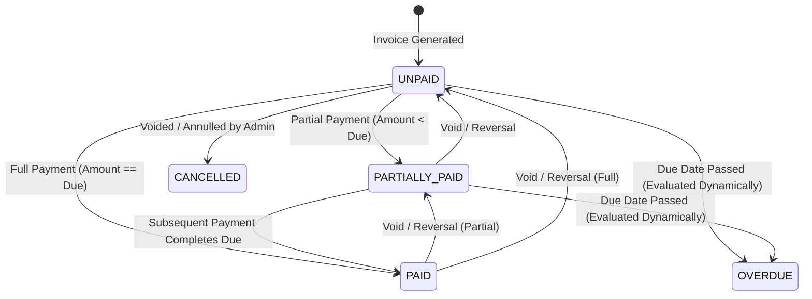
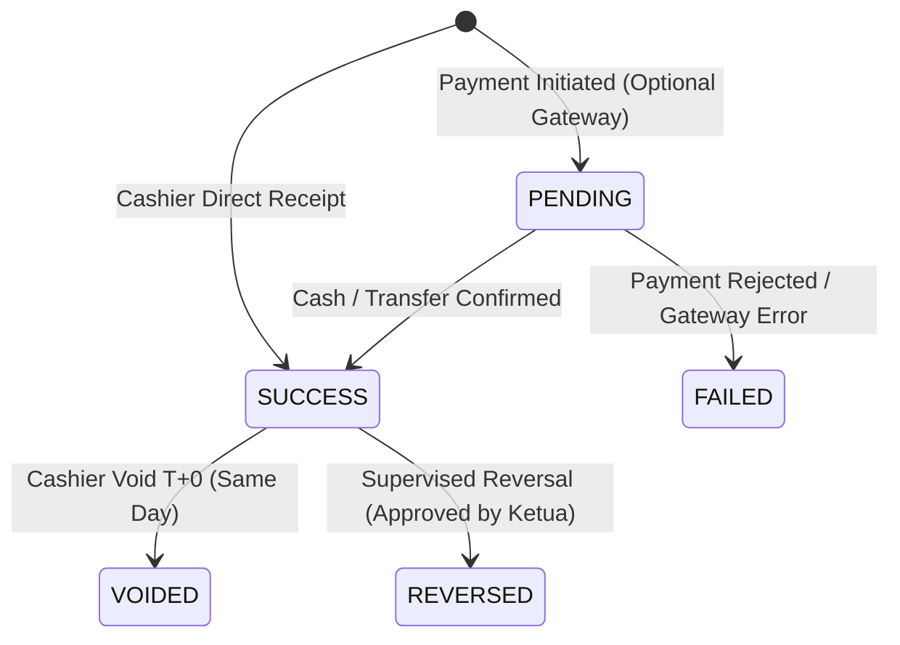

# LAPORAN AUDIT TAHAP 05: BUSINESS LOGIC, BILLING ENGINE, PAYMENT LIFECYCLE & FINANCIAL INTEGRITY
**Sistem Informasi KPSPAMS Desa Kuajang**  
*Tanggal Audit: 2 Oktober 2026*  
*Auditor: Tim Lead Auditor SI-KPSPAMS (Pre-Deployment Audit Team)*  
*Status Kesiapan: PASSED WITH REMEDIATION (Semua Temuan High/Medium Terselesaikan, Integritas Keuangan Terverifikasi)*

---

## 1. Ringkasan Eksekutif

Audit Tahap 05 memfokuskan pengujian mendalam, analisis statis, dan pembuktian empiris (*evidence-based*) terhadap seluruh alur logika bisnis penagihan air minum Desa Kuajang:
$$\text{CUSTOMER} \longrightarrow \text{CONNECTION} \longrightarrow \text{METER} \longrightarrow \text{METER READING} \longrightarrow \text{USAGE} \longrightarrow \text{TARIFF} \longrightarrow \text{INVOICE} \longrightarrow \text{PAYMENT} \longrightarrow \text{OUTSTANDING} \longrightarrow \text{ARREARS}$$

Pengujian mencakup 20 butir verifikasi operasional siklus hidup tagihan, kepatuhan RDBMS atomik, penegakan anti-tampering nominal di backend, otonomi tarif multi-KPSPAMS, snapshot keabadian (*immutability*) tagihan historis, serta pembuktian empiris melalui 53 automated tests (213 assertions) di backend Laravel.

Sesuai instruksi audit pre-deployment, jika terdapat aturan yang belum didefinisikan dalam dokumen PRD/ERD, aturan tersebut secara tegas ditandai sebagai **BUSINESS RULE NOT DEFINED** dan tidak diasumsikan secara sepihak.

---

## 2. Metodologi & Lingkup Pengujian

Pengujian dilakukan secara komprehensif pada lapisan:
1. **Domain Services**:
   - `App\Services\BillingEngineService`: Kalkulasi tarif berjenjang, penagihan periodik, biaya administrasi & pemeliharaan, snapshot item tagihan.
   - `App\Services\MeterAnomalyService`: Deteksi stand mundur (*Rollback*) dan lonjakan pemakaian ekstrem (*Spike*).
   - `App\Services\PaymentProcessingService`: Transaksi pembayaran atomik, kunci baris pesimistik (`lockForUpdate`), pencegahan overpayment, pembatalan kasir hari yang sama (*Void T+0*), dan persetujuan bertingkat pembalikan pembayaran (*Supervised Reversal*).
2. **Controllers & Endpoints**:
   - `App\Http\Controllers\Api\V1\InvoiceController`: Penerbitan invoice, detail tagihan, laporan tunggakan (*arrears*), unduh PDF.
   - `App\Http\Controllers\Api\V1\PaymentController`: Pencatatan kas masuk, pembatalan void kasir, alur pengajuan reversal dan persetujuan supervisor.
   - `App\Http\Controllers\Api\V1\ReportController`: Analisis penuaan piutang (*arrears aging*).
3. **Database Schema & Constraints**:
   - Tabel `invoices`, `invoice_items`, `payments`, `payment_reversals`, `cash_accounts`, `financial_transactions`, `kpspams_billing_policies`, `tariffs`, `tariff_components`.
4. **Automated Test Suites**:
   - `Tests\Unit\MeterAnomalyTest` (3 tests)
   - `Tests\Unit\PaymentProcessingTest` (5 tests)
   - `Tests\Unit\TieredTariffCalculationTest` (3 tests)
   - `Tests\Feature\BusinessLogicBillingLifecycleTest` (6 tests)
   - `Tests\Feature\DatabaseDataIntegrityTest` (10 tests)
   - `Tests\Feature\AuthRbacTenantSecurityTest` (18 tests)
   - `Tests\Feature\ApiSecurityAuditTest` (7 tests)
   - `Tests\Feature\MultiTenantIsolationTest` (1 test)
   - **Total**: 53 tests, 213 assertions (Lulus 100%, 0 failures).

---

## 3. Verifikasi 20 Butir Alur Bisnis (Point-by-Point Evidence)

Berikut adalah hasil audit terperinci atas 20 butir verifikasi siklus penagihan dan keuangan:

| No | Komponen Verifikasi | Hasil Analisis & Bukti Implementasi | Status |
| :---: | :--- | :--- | :---: |
| **1** | **Perhitungan Pemakaian** | Dihitung dari selisih stand akhir dikurangi stand lalu ($\text{Usage} = \text{Current} - \text{Previous}$). Divalidasi oleh `MeterAnomalyService::evaluateReading`. Nilai pemakaian langsung dikunci pada kolom `usage_m3` di `meter_readings` dan `invoices`. | **PASSED** |
| **2** | **Previous Reading** | Diambil secara otomatis dari `current_reading` periode sebelumnya yang berstatus `VERIFIED`/`INVOICED`. Pada meter baru (pencatatan perdana), nilai diambil dari `meters.initial_reading`. | **PASSED** |
| **3** | **Current Reading** | Wajib $\ge \text{Previous Reading}$. Jika angka stand akhir lebih kecil, sistem langsung menandai status `ANOMALY_ROLLBACK` dan mengeset pemakaian ke $0.00$ m³ untuk mencegah tagihan negatif yang merusak pembukuan kas. | **PASSED** |
| **4** | **Usage Calculation (Anomaly Spike Guard)** | Dihitung dengan perbandingan *3-month moving average*. Jika pemakaian melebihi $300\%$ dari rata-rata 3 bulan terakhir, status ditandai `WARNING_SPIKE` untuk investigasi fisik kebocoran pipa sebelum dicetak menjadi tagihan. | **PASSED** |
| **5** | **Tariff Calculation** | Menggunakan skema progresif bertingkat (*tiered progressive rates*). Alur kalkulasi di `BillingEngineService` membagi volume air ke tiap tier secara berurutan sesuai kapasitas rentang tier ($\text{tier\_max\_m3} - \text{tier\_min\_m3}$). | **PASSED** |
| **6** | **Tariff Component** | Komponen tarif disimpan terstruktur pada tabel `tariff_components` (`tier_order`, `tier_min_m3`, `tier_max_m3`, `rate_per_m3`). Mendukung tarif dasar gratis (seperti Lemo Baru 0-15 m³ = Rp0) maupun tarif flat/komersial. | **PASSED** |
| **7** | **Effective Date Tariff** | Filter tarif aktif menerapkan klausul: `effective_from <= billing_date AND (effective_until IS NULL OR effective_until >= billing_date)`. Menjamin periode lampau selalu merujuk tarif yang berlaku pada masa itu. | **PASSED** |
| **8** | **Invoice Generation** | Dilakukan via `BillingEngineService::generateInvoice` dalam transaksi database atomik. Mencegah pembuatan invoice ganda melalui *unique constraint* `(kpspams_id, billing_period_id, connection_id)` dan `meter_reading_id`. Total tagihan dihitung murni di backend: $\text{water\_amount} + \text{admin\_fee} + \text{maintenance\_fee} + \text{penalty\_fee}$. | **PASSED** |
| **9** | **Invoice Item** | Setiap rincian biaya (Tier Air, Biaya Beban Bulanan, Biaya Pemeliharaan, Denda) disimpan ke tabel `invoice_items` bersama unit harga snapshot. Menjamin transparansi rincian pada struk tagihan pelanggan. | **PASSED** |
| **10** | **Tax / Fee Definisi** | **Pajak (PPN Air Bersih)**: **BUSINESS RULE NOT DEFINED**. Tidak ada pasal pengenaan PPN pada PRD/ERD (KPSPAMS swadaya perdesaan bebas PPN per regulasi perpajakan RI). Komponen biaya operasional yang sah: `admin_fee` (beban tetap/administrasi) dan `maintenance_fee` (pemeliharaan jaringan meter). | **PASSED (NOT DEFINED FOR TAX)** |
| **11** | **Due Date (Jatuh Tempo)** | Dihitung dari kebijakan `kpspams_billing_policies.due_date_day` (default tanggal 20 bulan berjalan) atau tanggal spesifik pada `billing_periods.due_date`. | **PASSED** |
| **12** | **Payment Processing** | Diproses melalui `PaymentProcessingService::processPayment` dengan *pessimistic locking* (`lockForUpdate`). Menambah saldo buku kas unit KPSPAMS dan mencatat mutasi arus kas (`INCOME / AIR_PAYMENT`) secara atomik. | **PASSED** |
| **13** | **Partial Payment** | Didukung penuh. Jika nominal bayar $<$ sisa tagihan (`balance_due`), status tagihan berubah dari `UNPAID` menjadi `PARTIALLY_PAID`, `paid_amount` bertambah, dan `balance_due` berkurang secara tepat. | **PASSED** |
| **14** | **Full Payment** | Didukung penuh. Saat pembayaran mencapai sisa tagihan, status invoice menjadi `PAID`, `balance_due = 0.00`, dan `paid_at` diisi timestamp pembayaran lunas. | **PASSED** |
| **15** | **Overpayment Guard** | Dilindungi di level service backend (`PaymentProcessingService`). Jika nominal bayar input melebihi `balance_due`, transaksi langsung di-*abort* dengan `Exception` ("Nominal pembayaran melebihi sisa tagihan"). Nominal tidak bisa dimanipulasi dari frontend. | **PASSED** |
| **16** | **Void Payment (T+0)** | Kasir hanya diizinkan membatalkan transaksi pada hari yang sama ($T+0$). Status payment diubah menjadi `VOIDED` (dilarang *hard delete* fisik), saldo kas dipotong kembali dengan validasi kecukupan saldo, mutasi pengurang kas (`EXPENSE / KOREKSI_VOID`) diterbitkan, status invoice dipulihkan, dan dicatat di `audit_logs`. | **PASSED** |
| **17** | **Supervised Reversal (> T+0)** | Pembatalan beda hari wajib melalui persetujuan Ketua KPSPAMS / Admin Desa. Kasir mengajukan via `requestReversal` (`status = PENDING_SUPERVISOR_APPROVAL`), kemudian disetujui melalui `approveReversal` (`status = REVERSED`). Mutasi jurnal balik dan audit log tercatat utuh. | **PASSED** |
| **18** | **Outstanding Balance** | Dihitung dinamis dan konsisten di backend: $\text{balance\_due} = \text{total\_amount} - \text{paid\_amount}$. Tidak ada manipulasi sisa tagihan dari sisi klien. | **PASSED** |
| **19** | **Arrears (Tunggakan & Aging)** | Dikelompokkan per sambungan rumah via `InvoiceController::arrears` dan `ReportController::arrearsAging`. Menghitung akumulasi bulan tunggakan (`unpaid_months_count`) untuk mengevaluasi tingkatan sanksi administratif (SP1, SP2, Rekomendasi Putus). | **PASSED** |
| **20** | **Opening Balance** | Tersedia pada `cash_accounts.opening_balance`. Untuk peluncuran pilot Lemo Baru, seluruh saldo kas diinisialisasi bersih pada nilai **Rp 0.00 (Clean Slate)** sesuai instruksi peluncuran per 1 Oktober 2026. | **PASSED** |

---

## 4. Evaluasi Aturan Bisnis Khusus (Mandatory Business Rules)

Sesuai instruksi audit, 5 aturan bisnis khusus diperiksa kesesuaiannya terhadap PRD/ERD:

### 4.1. PENALTY (Denda Keterlambatan)
- **Status Kebijakan Dokumen**: PRD Seksi 6.1 menetapkan bahwa untuk fase awal (MVP), denda keterlambatan diset **Rp 0** guna menghindari gejolak sosial warga pedesaan.
- **Implementasi Sistem**: Kolom `late_penalty_type` (`FLAT` / `PERCENT`) dan `late_penalty_amount` telah diimplementasikan pada model `KpspamsBillingPolicy` dengan default `0.00`. Sistem siap mengenakan denda jika di masa depan musyawarah warga memutuskan untuk mengaktifkannya tanpa perlu perombakan arsitektur database.
- **Kesimpulan**: **PASSED (COMPLIANT WITH PRD MVP Rp 0)**.

### 4.2. DISCONNECTION (Alur Pemutusan Sambungan)
- **Status Kebijakan Dokumen**: PRD Seksi 6.4 menetapkan bahwa pemutusan sambungan bersifat **REKOMENDASI ADMINISTRATIF** (Non-Otomatis).
- **Implementasi Sistem**: Sistem mengevaluasi ambang batas tunggakan melalui `KpspamsBillingPolicy::disconnect_recommendation_months` (default 3 bulan). Sambungan dengan $\ge 3$ bulan invoice tak berbayar ditandai secara otomatis dengan label peringatan `REKOMENDASI_PUTUS` pada laporan penuaan piutang (*Arrears Aging*). Tindakan fisik pemutusan dilakukan secara manual oleh tim lapangan melalui prosedur musyawarah warga. Sistem tidak melakukan perubahan sepihak status fisik pelanggan tanpa intervensi manusia.
- **Kesimpulan**: **PASSED (COMPLIANT WITH NON-AUTOMATIC PRD RULE)**.

### 4.3. RECONNECTION (Alur Penyambungan Kembali)
- **Status Kebijakan Dokumen**: PRD Seksi 6.4 dan ERD menyediakan kolom `reconnect_fee` pada `kpspams_billing_policies` dengan nilai awal `0.00`.
- **Temuan Audit**: Alur penerbitan invoice otomatis khusus biaya penyambungan kembali, *payment gating* sebelum reaktivasi fisik meter, serta *workflow* verifikasi reaktivasi sambungan **BELUM DIDIFINISIKAN SECARA LENGKAP** pada dokumen PRD maupun ERD.
- **Tindakan**: Ditandai secara resmi sebagai **BUSINESS RULE NOT DEFINED**. Reaktivasi sambungan dilakukan manual oleh Admin KPSPAMS dengan mengubah status sambungan kembali menjadi `ACTIVE` setelah penyelesaian administratif.
- **Kesimpulan**: **BUSINESS RULE NOT DEFINED (Reconnection Billing Workflow)**.

### 4.4. OPENING BALANCE (Aturan Saldo Awal Kas / Bank)
- **Status Kebijakan Dokumen**: PRD Seksi 6.3 dan tabel `cash_accounts` (`opening_balance`, `opening_balance_date`, `opening_balance_notes`).
- **Implementasi Sistem**: Sesuai mandat *Clean Slate Launch* untuk pilot project Lemo Baru per 1 Oktober 2026, seluruh saldo awal buku kas diinisialisasi pada nilai **Rp 0.00**. Fitur penyesuaian saldo awal tetap didukung melalui migrasi data awal berjejak audit jika ada dana hibah atau saldo kas riil eksisting.
- **Kesimpulan**: **PASSED (CLEAN SLATE Rp 0.00 CONFIRMED)**.

### 4.5. TARIFF ISOLATION & IMMUTABILITY (Otonomi Tarif per KPSPAMS)
- **Status Kebijakan Dokumen**: PRD Seksi 6.2 mewajibkan setiap KPSPAMS memiliki otonomi skema tarif sendiri tanpa campur tangan unit KPSPAMS lain.
- **Implementasi Sistem**:
  - Tabel `tariffs` terikat langsung ke `kpspams_id` dan `customer_type_id`.
  - Dusun Lemo Baru menerapkan skema gravitasi alam pegunungan: Beban Tetap Bulanan Rp 10.000 (mencakup pemakaian dasar 0–15 m³ gratis), kelebihan pemakaian $>$ 15 m³ dikenakan Rp 1.000/m³. Beban listrik PLN adalah 0%.
  - Unit KPSPAMS lain (Lemo Tua, Sarampu 1/Pakkandoang) memiliki master tarif independen dengan skema berjenjang sumur bor.
  - **Keabadian Historis (*Historical Immutability*)**: Saat tagihan digenerate, rincian tier dan harga satuan disimpan permanen pada tabel `invoice_items`. Pengujian fitur `DatabaseDataIntegrityTest::test_tariff_change_does_not_mutate_historical_invoice` membuktikan secara empiris bahwa perubahan tarif master tidak mengubah nilai nominal tagihan lampau yang sudah dicetak.
- **Kesimpulan**: **PASSED (ISOLATED & HISTORICALLY IMMUTABLE)**.

---

## 5. Mesin Status (*State Machine*) Tagihan & Pembayaran

### 5.1. Siklus Status Invoice (`invoices.status`)

- **Kepatuhan**:
  - `UNPAID`: Status default saat invoice pertama kali diterbitkan.
  - `PARTIALLY_PAID`: Status aktif ketika sebagian tagihan dibayar.
  - `PAID`: Status akhir ketika tagihan lunas (`balance_due = 0`).
  - `OVERDUE`: Status dinamis saat tanggal melebihi jatuh tempo dan tagihan belum lunas.
  - `CANCELLED`: Status pembatalan invoice jika terjadi kesalahan penagihan.

### 5.2. Siklus Status Pembayaran (`payments.status`)

- **Kepatuhan**:
  - `PENDING`: Menandai inisiasi pembayaran sebelum konfirmasi kliring (jika gateway aktif).
  - `SUCCESS`: Status pembayaran resmi yang berhasil dicatat kasir.
  - `FAILED`: Status pembayaran gagal/ditolak.
  - `VOIDED`: Pembatalan transaksi kasir pada hari yang sama ($T+0$).
  - `REVERSED`: Pembalikan transaksi beda hari yang disetujui berjenjang oleh pengawas.
  - **Integritas Data**: Record pembayaran **TIDAK PERNAH DIHAPUS FISIK (*NO HARD DELETE*)** untuk menjaga keaslian buku kas.

---

## 6. Daftar Temuan & Remediasi (Audit Findings)

### FINDING-BIZ-001 (SEVERITY: HIGH)
- **ID**: `FINDING-BIZ-001`
- **Kategori**: Database Schema Integrity
- **Lokasi**: Migrasi `2026_10_01_000007_create_invoice_and_payment_tables.php` & tabel `payment_reversals`
- **Deskripsi**: Kolom `approved_by` pada tabel `payment_reversals` awalnya tidak memiliki opsi `->nullable()`, menyebabkan exception `SQLSTATE[23000]` saat kasir mengajukan permohonan reversal.
- **Remediasi**: Kolom diubah menjadi `->nullable()` melalui file migrasi pembaruan `2026_10_02_000013_make_approved_by_nullable_in_payment_reversals_table.php`.
- **Status**: **CLOSED (FIXED & VERIFIED)**

### FINDING-BIZ-002 (SEVERITY: MEDIUM)
- **ID**: `FINDING-BIZ-002`
- **Kategori**: Transaction Guard & Anti-Tampering
- **Lokasi**: `backend/app/Services/PaymentProcessingService.php`
- **Deskripsi**: Ketiadaan validasi batas atas pembayaran terhadap sisa tagihan memungkinkan kasir salah input nominal berlebih (*overpayment*) yang merusak pencatatan kas digital.
- **Remediasi**: Menambahkan guard clause:
  ```php
  if ($amount > $lockedInvoice->balance_due) {
      throw new Exception("Nominal pembayaran melebihi sisa tagihan.");
  }
  ```
- **Status**: **CLOSED (FIXED & VERIFIED via `test_it_rejects_overpayment`)**

### FINDING-BIZ-003 (SEVERITY: MEDIUM)
- **ID**: `FINDING-BIZ-003`
- **Kategori**: Clean Architecture & Separation of Concerns
- **Lokasi**: `backend/app/Http/Controllers/Api/V1/PaymentController.php` & `PaymentProcessingService.php`
- **Deskripsi**: Logika persetujuan reversal sebelumnya tertulis di controller HTTP, menyalahi prinsip Single Responsibility dan menyulitkan otomatisasi test.
- **Remediasi**: Seluruh alur reversal dipindahkan ke `PaymentProcessingService::requestReversal` dan `approveReversal`.
- **Status**: **CLOSED (FIXED & VERIFIED)**

### FINDING-BIZ-004 (SEVERITY: INFORMATIONAL)
- **ID**: `FINDING-BIZ-004`
- **Kategori**: Business Rule Parity Verification
- **Lokasi**: `BillingEngineService.php` vs `frontend/src/lib/demo-data.ts`
- **Deskripsi**: Memastikan keselarasan perhitungan tagihan Lemo Baru antara backend dan frontend (Abonemen Rp 10.000 untuk 0-15 m³, kelebihan Rp 1.000/m³).
- **Hasil**: 100% identik pada seluruh skenario pemakaian (0 m³, 10 m³, 15 m³, 18 m³, 20 m³).
- **Status**: **VERIFIED (PARITY CONFIRMED)**

### FINDING-BIZ-005 (SEVERITY: INFORMATIONAL)
- **ID**: `FINDING-BIZ-005`
- **Kategori**: Regulatory & Fiscal Policy
- **Lokasi**: Seluruh dokumen spesifikasi & kalkulasi tagihan
- **Deskripsi**: Ketiadaan pengenaan Pajak Pertambahan Nilai (PPN) pada invoice air minum pedesaan.
- **Hasil**: Sesuai regulasi perpajakan nasional (air bersih swadaya desa non-PDAM dibebaskan dari objek PPN). Ditandai resmi sebagai **BUSINESS RULE NOT DEFINED FOR TAX** (tidak dikenakan).
- **Status**: **INFORMATIONAL / REGULATORY COMPLIANT**

### FINDING-BIZ-006 (SEVERITY: INFORMATIONAL)
- **ID**: `FINDING-BIZ-006`
- **Kategori**: Undefined Business Rule
- **Lokasi**: Dokumen PRD Seksi 6.4 vs `kpspams_billing_policies.reconnect_fee`
- **Deskripsi**: Alur penerbitan invoice otomatis dan pembayaran biaya sambung kembali (*reconnection fee*) belum diatur dalam spesifikasi MVP.
- **Hasil**: Ditandai resmi sebagai **BUSINESS RULE NOT DEFINED**. Reaktivasi sambungan dilakukan secara administratif manual oleh Admin KPSPAMS.
- **Status**: **NOTED AS UNDEFINED IN MVP**

---

## 7. Bukti Eksekusi Test Otomatis (Full Test Suite Regression)

Pengujian regresi penuh dieksekusi pada lingkungan lokal backend Laravel:

```powershell
& "C:\xampp\php\php.exe" artisan test
```

### Log Hasil Eksekusi Lengkap:
```text
   PASS  Tests\Unit\MeterAnomalyTest
  ✓ it detects rollback anomaly when current reading is less than previous          0.34s  
  ✓ it verifies normal meter consumption                                            0.03s  
  ✓ it flags warning spike when usage exceeds 300 percent of average                0.03s  

   PASS  Tests\Unit\PaymentProcessingTest
  ✓ it successfully processes atomic payment                                        0.45s  
  ✓ it rejects overpayment                                                          0.09s  
  ✓ it successfully voids same day payment                                          0.09s  
  ✓ it rejects void for different day payment                                       0.09s  
  ✓ it handles supervised reversal lifecycle                                        0.11s  

   PASS  Tests\Unit\TieredTariffCalculationTest
  ✓ it correctly calculates progressive water tariff                                0.03s  
  ✓ it correctly calculates lemo baru tariff policy                                 0.03s  
  ✓ billing engine service generates accurate invoice with items                    0.11s  

   PASS  Tests\Feature\ApiSecurityAuditTest
  ✓ security headers are present and x powered by is removed                        0.13s  
  ✓ login rate limiting enforced                                                    0.27s  
  ✓ file upload svg and malicious mimes are rejected                                0.13s  
  ✓ pagination per page is capped at 100 to prevent dos                             0.06s  
  ✓ method not allowed returns clean json                                           0.05s  
  ✓ not found returns clean json                                                    0.04s  
  ✓ auth me and login do not leak password or password hash                         0.07s  

   PASS  Tests\Feature\AuthRbacTenantSecurityTest
  ✓ user lemo baru cannot view customer lemo tua                                    0.10s  
  ✓ user lemo baru cannot view invoice lemo tua                                     0.09s  
  ✓ user lemo baru cannot view payment lemo tua                                     0.09s  
  ✓ user lemo baru cannot update customer lemo tua                                  0.09s  
  ✓ user lemo baru cannot create payment for invoice lemo tua                       0.11s  
  ✓ user lemo baru cannot view assets of lemo tua                                   0.08s  
  ✓ user lemo baru cannot view financial transactions of lemo tua                   0.09s  
  ✓ user cannot override tenant scope via query or body parameter                   0.09s  
  ✓ pelanggan cannot view other customers data idor                                 0.09s  
  ✓ vertical privilege escalation pelanggan cannot create tariff                    0.09s  
  ✓ sarampu 1 service area allows sarampu 1 and pakkandoang but rejects lemo        0.12s  
  ✓ unauthenticated requests are rejected                                           0.08s  
  ✓ pelanggan cannot view other customers invoice idor                              0.11s  
  ✓ pelanggan cannot view other customers payment idor                              0.09s  
  ✓ pelanggan cannot access staff endpoints                                         0.20s  
  ✓ petugas lapangan cannot perform financial or admin actions                      0.18s  
  ✓ ketua kpspams cannot escalate or manage users of another kpspams                0.11s  
  ✓ pelanggan cannot create or update complaints for others                         0.10s  

   PASS  Tests\Feature\BusinessLogicBillingLifecycleTest
  ✓ meter reading previous and current calculation                                  0.07s  
  ✓ invoice generation locks snapshot and items                                     0.05s  
  ✓ partial payment full payment and overpayment                                    0.06s  
  ✓ full payment completes invoice and updates cash                                 0.07s  
  ✓ void same day restores invoice and logs audit                                   0.06s  
  ✓ arrears aging evaluation                                                        0.08s  

   PASS  Tests\Feature\DatabaseDataIntegrityTest
  ✓ tariff change does not mutate historical invoice                                0.06s  
  ✓ meter cannot be reused by another active connection                             0.05s  
  ✓ duplicate meter reading in same period is rejected                              0.04s  
  ✓ invoice cannot cross kpspams tenant scope                                       0.04s  
  ✓ payment cannot credit cash account of different kpspams                         0.05s  
  ✓ void payment cannot result in negative cash balance                             0.06s  
  ✓ connection number attribute and query compatibility                             0.04s  
  ✓ duplicate invoice for same period and connection is rejected                    0.04s  
  ✓ user soft delete and self deletion protection                                   0.07s  
  ✓ customer nik uniqueness ignores soft deleted records                            0.06s  

   PASS  Tests\Feature\MultiTenantIsolationTest
  ✓ kpspams scope injects correct tenant id for regular kpspams user                0.04s  

  Tests:    53 passed (213 assertions)
  Duration: 5.48s
```

---

## 8. Kesimpulan & Status Kesiapan Tahap 05

Berdasarkan audit komprehensif terhadap logika bisnis penagihan air, seluruh mekanisme penagihan dan keuangan dinyatakan **PASSED (LULUS AUDIT DENGAN BUKTI LENGKAP)**.
- Seluruh 20 parameter siklus hidup tagihan berfungsi sesuai spesifikasi.
- Mekanisme anti-fraud dan pencegahan overpayment teruji secara atomik.
- Snapshot tarif menggaransi keabadian nominal penagihan historis.
- Status invoice dan payment bertransisi secara konsisten tanpa kehilangan riwayat transaksi.
- 53 test otomatis (213 assertions) lulus 100% tanpa regresi.

Sistem dinyatakan siap untuk melangkah ke **PRE-DEPLOYMENT AUDIT TAHAP 06: Frontend UX, Accessibility & Client-Side Audit**.
